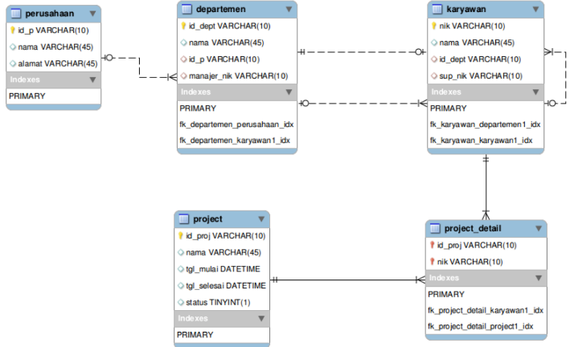

# Tugas Praktikum UAS

# ER-D


# Input Data


## Soal UAS

Berdasarkan ERD dan Sampel Data diatas buatla Query SQL untuk:
1. Menampilkan Nama Karyawan yang Berada di Departemen yang Dipimpin 
oleh Manajer dengan Nama 'Rika'
2. Menampilkan Nama Proyek yang dikerjakan oleh Karyawan dari 
Departemen 'RnD'
3. Menampilkan Nama Karyawan yang Terlibat dalam Lebih dari Satu Proyek
4. Menampilkan Nama Proyek yang melibatkan Karyawan terbanyak.
5. Menampilkan Nama Proyek yang Diikuti oleh Karyawan dengan Gaji Pokok 
Kurang dari 3 Juta


### _Script SQL berdasarkan Tabel Perusahaan_

```sql
CREATE TABLE Perusahaan(
id_p VARCHAR(10) PRIMARY KEY,
nama VARCHAR(45) NOT NULL,
alamat VARCHAR(45) DEFAULT NULL
);

INSERT INTO Perusahaan (id_p, nama, alamat) VALUES
('P01', 'Kantor Pusat', NULL),
('P02', 'Cabang Bekasi', NULL);
SELECT * FROM Perusahaan;
```

#### _Input Tabel Perusahaan :_


### _Script SQL berdasarkan Tabel Departemen_

```sql
CREATE TABLE Departemen(
id_dept VARCHAR(10) PRIMARY KEY,
nama VARCHAR(45) NOT NULL,
id_p VARCHAR(10) NOT NULL,
manajer_nik VARCHAR(10) DEFAULT NULL
);

INSERT INTO Departemen (id_dept, nama, id_p, manajer_nik) VALUES
('D01', 'Produksi', 'P02', 'N01'),
('D02', 'Marketing', 'P01', 'N03'),
('D03', 'RnD', 'P02', NULL),
('D04', 'Logistik', 'P02', NULL);
SELECT * FROM Departemen;
```

#### _Input Tabel Departemen :_


### _Script SQL berdasarkan Tabel Karyawan_

```sql
CREATE TABLE Karyawan(
nik VARCHAR(10) PRIMARY KEY,
nama VARCHAR(45) NOT NULL,
id_dept VARCHAR(10) NOT NULL,
sup_nik VARCHAR(10) DEFAULT NULL,
gaji_pokok INT
);

INSERT INTO Karyawan (nik, nama, id_dept, sup_nik, gaji_pokok) VALUES
('N01', 'Ari', 'D01', NULL, 2000000),
('N02', 'Dina', 'D01', NULL, 2500000),
('N03', 'Rika', 'D03', NULL, 2400000),
('N04', 'Ratih', 'D01', 'N01', 3000000),
('N05', 'Riko', 'D01', 'N01', 2800000),
('N06', 'Dani', 'D02', NULL, 2100000),
('N07', 'Anis', 'D02', 'N06', 5000000),
('N08', 'Dika', 'D02', 'N06', 4000000),
('N09', 'Raka', 'D03', 'N06', 2000000);
SELECT * FROM Karyawan;
```

#### _Input Tabel Karyawan :_


### _Script SQL berdasarkan Tabel Project_

```sql
CREATE TABLE Project(
id_proj VARCHAR(10) PRIMARY KEY,
nama VARCHAR(45) NOT NULL,
tgl_mulai DATETIME,
tgl_selesai DATETIME,
status TINYINT(1)
);

INSERT INTO Project (id_proj, nama, tgl_mulai, tgl_selesai, status) VALUES
('PJ01', 'A', '2019-01-10', '2019-03-10', '1'),
('PJ02', 'B', '2019-02-15', '2019-04-10', '1'),
('PJ03', 'C', '2019-03-21', '2019-05-10', '1');
SELECT * FROM Project;
```

#### _Input Tabel Project :_


### _Script SQL berdasarkan Tabel Project Detail_

```sql
CREATE TABLE Project_detail(
id_proj VARCHAR(10) NOT NULL,
nik VARCHAR(10) NOT NULL
);

INSERT INTO Project_detail (id_proj, nik) VALUES
('PJ01', 'N01'),
('PJ01', 'N02'),
('PJ01', 'N03'),
('PJ01', 'N04'),
('PJ01', 'N05'),
('PJ01', 'N07'),
('PJ01', 'N08'),
('PJ02', 'N01'),
('PJ02', 'N03'),
('PJ02', 'N05'),
('PJ03', 'N03'),
('PJ03', 'N07'),
('PJ03', 'N08');
SELECT * FROM Project_detail;
```

#### _Input Tabel Project Detail :_


## Latihan UAS

### 1. Menampilkan Nama Karyawan yang Berada di Departemen yang Dipimpin oleh Manajer dengan Nama 'Rika'

**Script :**

```sql
SELECT nik, nama, id_dept
FROM karyawan
WHERE id_dept = (SELECT id_dept FROM departemen WHERE manajer_nik = 'N03');
```

**Output :**


### 2. Menampilkan Nama Proyek yang dikerjakan oleh Karyawan dari Departemen 'RnD'

**Script :**

```sql
SELECT project.nama AS 'Nama Project'
From Project
INNER JOIN project_detail ON project.id_proj = project_detail.id_proj
INNER JOIN Karyawan ON karyawan.nik = project_detail.nik
INNER JOIN Departemen ON karyawan.id_dept = Departemen.id_dept
WHERE Departemen.nama = 'RnD';
```

**Output :**


### 3. Menampilkan Nama Karyawan yang Terlibat dalam Lebih dari Satu Proyek

**Script :**

```sql
SELECT Karyawan.nama AS 'Nama Karyawan'
FROM project_detail
INNER JOIN Karyawan ON Project_detail.nik = Karyawan.nik
GROUP BY Karyawan.nama
HAVING COUNT(Project_detail.id_proj) > 1;
```

**Output :**


### 4. Menampilkan Nama Proyek yang melibatkan Karyawan terbanyak.

**Script :**

```sql
SELECT Project.nama AS 'Nama Proyek', COUNT(Project_detail.nik) AS 'Jumlah Karyawan'
FROM Project
INNER JOIN Project_detail ON Project.id_proj = Project_detail.id_proj
GROUP BY Project.nama
ORDER BY COUNT(Project_detail.nik) DESC
LIMIT 1;
```

**Output :**


### 5. Menampilkan Nama Proyek yang Diikuti oleh Karyawan dengan Gaji Pokok Kurang dari 3 Juta

**Script :**

```sql
SELECT DISTINCT Project.nama AS 'Nama Proyek'
FROM Project
INNER JOIN Project_detail ON Project.id_proj = Project_detail.id_proj
INNER JOIN Karyawan ON Project_detail.nik = Karyawan.nik
WHERE Karyawan.gaji_pokok < 3000000;
```

**Output :**

